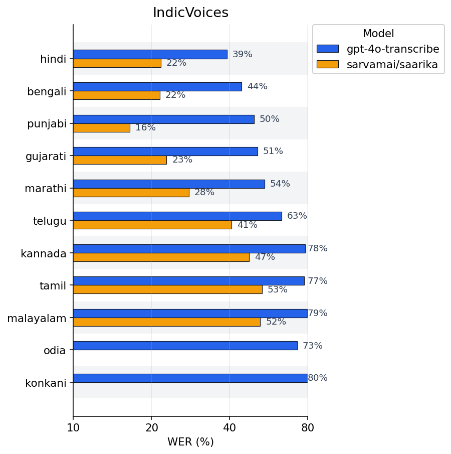
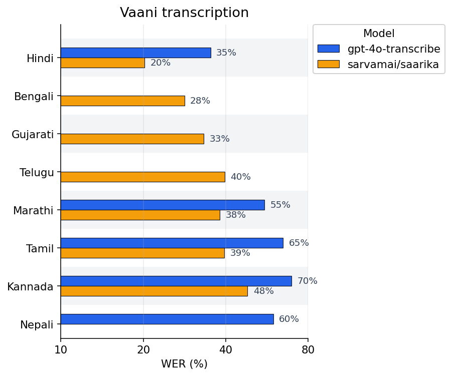

# stt-bench

`stt-bench` is a command-line utility for benchmarking speech-to-text models on English & multilingual datasets with native support for Indic languages.

## Results
<div align="center">
  
  
</div>


## Installation

```bash
uv pip install stt-bench
```

## Prerequisites

- You may also need to install [FFmpeg](https://ffmpeg.org/download.html) (version 6 or newer) for some of the datasets. (Lahaja, Svarah)

## Models

| Provider | Model | Status |
|----------|-------|--------|
| Kalpa Labs | Proprietary models | Coming soon... |
| OpenAI | gpt-4o-transcribe, whisper-1 | ✅ |
| Deepgram | Nova-3 | ✅ |
| Sarvam | Sarika | ✅ |
| Gemini | Flash, Pro* | ✅ |

> *Gemini-2.5 Pro is not suitable for real-time conversations due to thinking mode enabled by default.

## Supported Datasets
| Dataset | Languages | Description |
|---------|-----------|-------------|
| IndicVoices | 22 Scheduled Languages of Indian Constitution [1] | Large-scale multilingual speech corpus for Indian languages |
| Lahaja | Hindi | Diverse Hindi dialects spanning across 83 districts and 132 speakers |
| Svarah | English | Spoken English with diverse dialects of 117 speakers spanning across 65 districts |
| Fleurs | 102 languages including major Indian languages | For Indian languages, English data is translated to specific languages, and spoken by native speakers |
| Vaani | Covers almost all Indian spoken languages including 22 Indian scheduled languages | Speakers across India are shown an image and asked to impromptu describe the image |

> [1] [22 Scheduled Languages of Indian Constituion](https://en.wikipedia.org/w/index.php?title=Languages_with_official_recognition_in_India) constitute of 
## Usage
To see all available options run `stt-bench --help` 

### 1. Configure environment variables

Set the variables required by the models you plan to evaluate:

```
HF_TOKEN, OPENAI_API_KEY, MENKA_BASE_URL, DEEPGRAM_API_KEY, SARVAM_API_KEY, GEMINI_API_KEY
```

### 2. Run inference across datasets

```bash
stt-bench run --model gpt-4o-transcribe
```

This command writes inference outputs to `inference/{model}/{dataset}` for every dataset included in the run. Each dataset directory contains CSV files named `*predictions.csv`. To evaluate a subset of datasets, specify them explicitly:

```bash
stt-bench run --model gpt-4o-transcribe --eval-datasets Fleurs
```

### 3. Evaluate WER and CER metrics

```bash
stt-bench evaluate --dir inference/{model}
```

The evaluation step generates `metrics/{model}/{dataset}/evaluation_metrics.csv`, summarizing WER and CER per split and providing overall metrics for the dataset.
